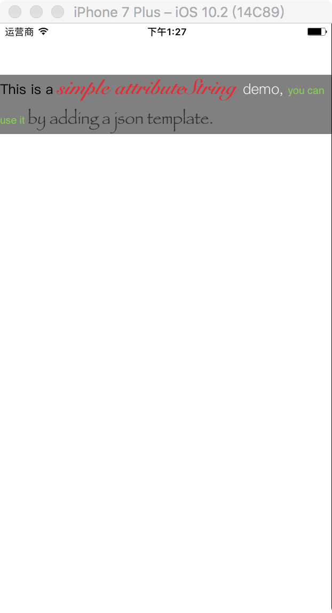

##ABOUT
It's a simple demo for attributeString using core text.You can just add it to your custom view by writing a json template.Following is the structure of coreTextView:
- CTDisplayView,which is only responsible for displaying.
- CTFrameParser,it completes the frame of text.
- CTFrameParserConfig,the default configuration for text,of course you can define it by youself.
- CoreTextData,it provides the data for displaying.

##Usage
first,you need a template like this:
```
 [
  {
  "type": "txt",
  "content": "This is a ",
  "fontName": "default",
  "fontSize": 0,
  "color": "default"
  },
  {
  "type": "txt",
  "content": "simple attributeString ",
  "fontName": "Snell Roundhand Bold",
  "fontSize": 26,
  "color": "0xe7292e"
  },
  {
  "type": "txt",
  "content": "demo, ",
  "fontName": "PingFangSC-Light",
  "fontSize": 18,
  "color": "0xf9f9f9"
  },
  {
  "type": "txt",
  "content": "you can use it ",
  "fontName": "PingFangSC-Bold",
  "fontSize": 13,
  "color": "0x85d64d"
  },
  {
  "type": "txt",
  "content": "by adding a json template.",
  "fontName": "Papyrus",
  "fontSize": 20,
  "color": "0x333333"
  }
  ]
```
next,you can add a displayView and custom like this:
```
 let ctView = CTDisplayView()
        view.addSubview(ctView)
        
        ctView.backgroundColor = UIColor.gray
        ctView.setX(view.x())
        ctView.setY(view.y()+64)
        ctView.setWidth(width: view.width())
        
        let config:CTFrameParserConfig = CTFrameParserConfig()
        config.width = ctView.width()
        config.lineSpace = 10
        
        let path = Bundle.main.path(forResource: "template", ofType: "json")
        let data = CTFrameParser.parserTemplateFlie(path! as NSString , config: config)
        ctView.data = data
        ctView.setHeight(height: data.height)
```
then you can see it.


